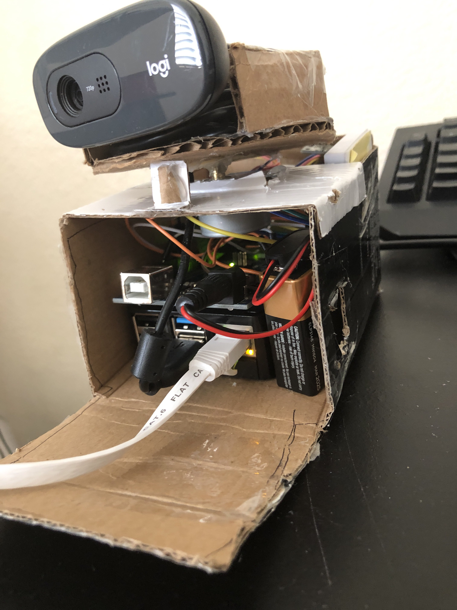
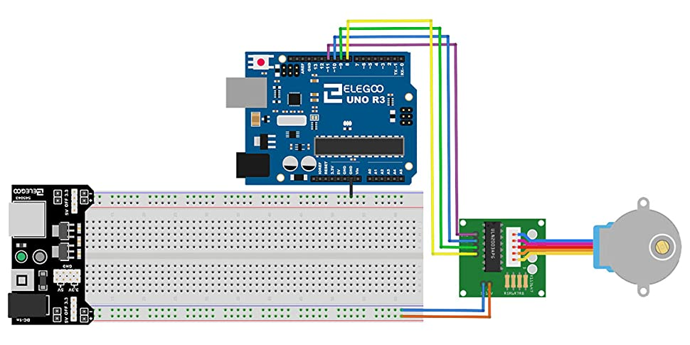
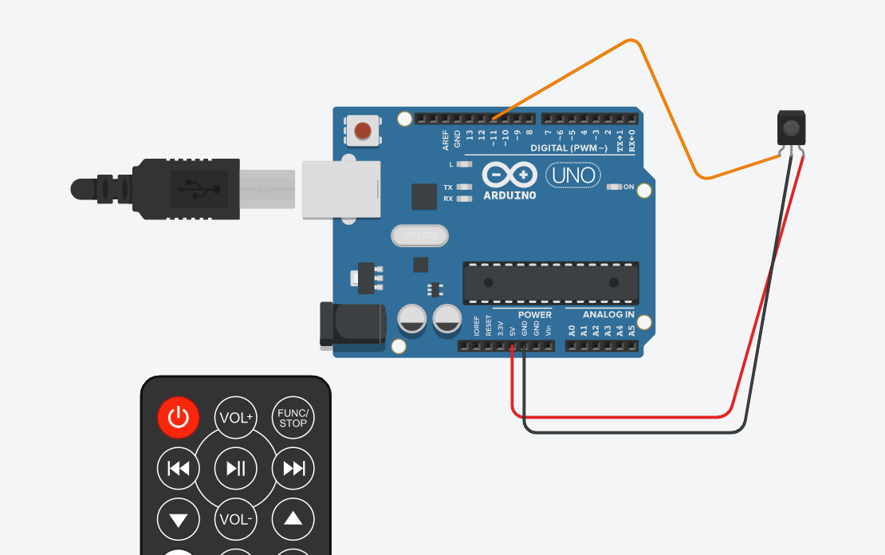

# DIY Home security camera system.

The camera is equipped with couple functions:

  * Camera can be rotated by using remote control, so that you can always find the perfect angle effortlessly.
  * The video can be live-monitored all the time everywhere on the world.
  * It is a plug-and-play system that came with really simple installation, require no GUI.

## Tools needed

1. Rasperri Pi (model 3 and 4)
2. Arduino
3. 8BYJ-48 stepper motor (with ULN2003 driver board).
4. IR receiver module and remote (any remote will work, include your TV remote)
5. Cables.
6. Cardboards ( or other material to build the camera )

## Preparation

*Prepare the hardware:*

* Set up the stepper motors and the IR receiever as in the picture.

**Note that the stepper driver will be plugged into  4,6,5,7 IN ORDER (not 8,9,10,11) as in the picture.**
* Install [IRremote](https://www.arduino.cc/reference/en/libraries/irremote/)
* Execute the hardware.ino script with the [Arduino IDE](https://www.arduino.cc/en/Guide/Environment)
* Pressing the up and down button on the remote to make sure that they work properly.
* Build the body of the camera by cardboard or any other materials of your choice. ( i.e. 3d printer )
**About the battery for the arduino, we can use 9V battery or power from the Rasperri Pi.**

*Make sure you keep the line of sight with the IR.*

*Prepare the software*

* Install [Arduino package](https://www.arduino.cc/en/software) and execute the hardware.ino.
**Make sure that you have `python3.7` and above installed with newest `pip`.**
* It is recommended to create [virtual environment](https://docs.python.org/3/tutorial/venv.html) before continuing.
* Install the requirements
`sudo pip install -r requirements.txt`
* Verify that flask is installed correctly by : `flask --help`
**Set up your correct [public IP address](https://opensource.com/article/18/5/how-find-ip-address-linux) on the run.sh file**
* Execute `run.sh` to create flask environment variable and deploy the server.
`source ./run.sh`

After execution, you should see flask server successfully deployed on your public IP.

**We need to make the Pi automatically launch the server without us intervening it, so that it can function fully like a camera.**

We can do that by executing the `run.sh` script at the beginning of the system boot. `/etc/rc.local` is always executed after multilevel user booted and before the system do anything else, which is perfect to add our script in.

`echo "source <your directory>/run.sh" >> /etc/rc.local`

From now on, whenever you log in, the flask server will be automatically deployed on your public IP address.

**Best part, Enjoy the result!!!**

(I am running the server on my private local IP)

(The engineering part of the camera will be handled by mechanic guy so we don't have to worry about it too much)

